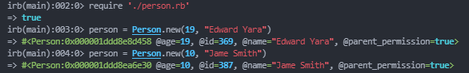
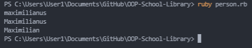

# OOP-School-Library`
Here in this project I have created a class `Person` with the following:
- Instance vars: `@id`, `@name`, and `@age`.
- Constructor with `name`, `age`, and `parent_permission` as parameter. name and `parent_permission` are optional and have default values of `"Unknown"` and `true`.
- Getters for `@id`, `@name`, and `@age`.
- Setters for `@name` and `@age`.
- Private method `is_of_age?` that returns `true` if `@age` is greater or equal to 18 and false otherwise.

## Project requirements
The project requirements can be found [here](https://github.com/microverseinc/curriculum-ruby/blob/main/oop/school_library_people.md)

## Built with
Programming language: `Ruby`
Frameworks: `NaN`
Technology: `NaN`
Testing tool: [Rubocup](https://rubocop.org/)

## Installation
- Git clone `https://github.com/oluyaratosin123/OOP-School-Library.git`
- run `cd OOP-School-Library` in your command line

## Authors

👤 **Author1**

- GitHub: [@oluyaratosin123](https://github.com/oluyaratosin123)
- Twitter: [@TOluyara](https://twitter.com/TOluyara)
- LinkedIn: [LinkedIn](https://www.linkedin.com/in/edward-oluyara/)

## 🤝 Contributing

Contributions, issues, and feature requests are welcome!

## Show your support

Give a ⭐️ if you like this project!

## 📝 License

This project is [MIT](./MIT.md) licensed.
